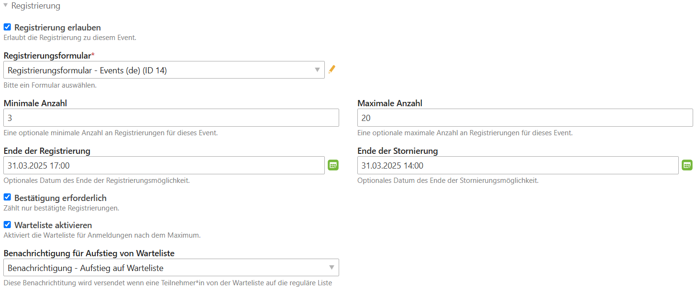
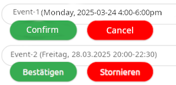

# Contao Event Registration

Contao extension to allow registration for events.

Contao-Erweiterung, um die Registrierung für Veranstaltungen zu ermöglichen.

## Usage

After installation you will have the possibility to enable registration for individual events in the event's settings:

It is also possible to add and register multiple events to the registration form:

Members can view their registered events as a list and confirm or cancel events:

## Documentations

 [English manual](en/README.md)

 [Deutsches Handbuch](de/README.md)
